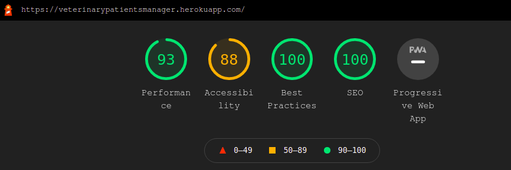
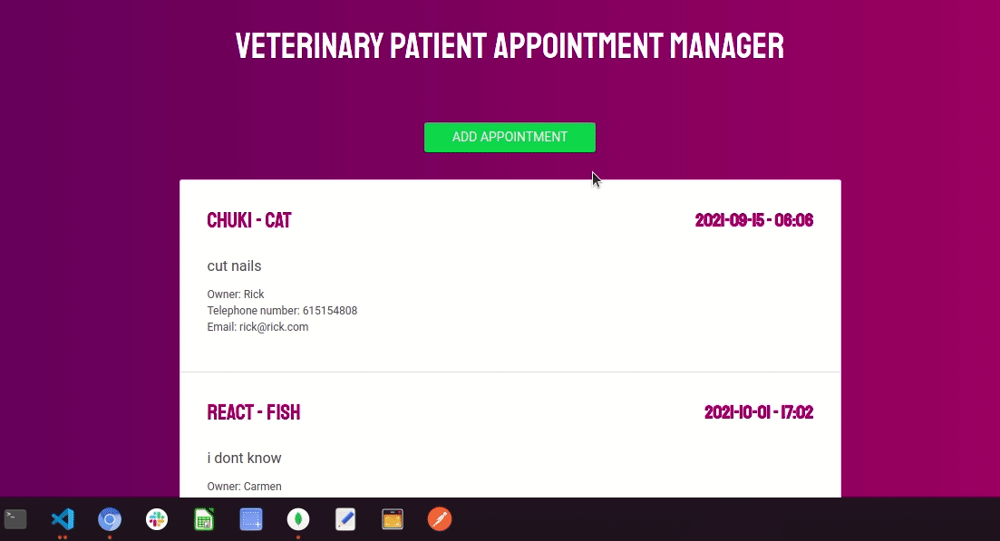

<!-- PROJECT LOGO -->
<br />
<p align="center">
<h4 align="center">Veterinary Patient Appointment Manager</h4>
  <p align="center">
    <a href="https://veterinarypatientsmanager.herokuapp.com/">View Web Application</a>
  </p>
  <p align="center">

</p>
<p align="center">
</p>

</p>  
<p align="center">
</p>

</p>

<!-- TABLE OF CONTENTS -->
<details open="open">
  <summary>Table of Contents</summary>
  <ol>
    <li><a href="#learn-more">Learn More</a></li>
    <li><a href="#prerequisites">Prerequisites</a></li>
    <li><a href="#installation">Installation</a></li>
    <li><a href="#about-the-project">About The Project</a></li>
    <li><a href="#app-overview">App Overview</a></li>
    <li><a href="#languages-and-tools">Languages and Tools</a></li>
    <li><a href="#contact">Contact</a></li>
  </ol>
</details>

## Learn more

To be more familiar with the libraries and frameworks I have mainly used I will leave a short explanation here:

### [React-router](https://reactrouter.com/)

npm i react-router-dom

React Router is a collection of navigational components that compose declaratively with your application. Whether you want to have bookmarkable URLs for your web app or a composable way to navigate in React Native, React Router works wherever React is rendering--so take your pick!  

### [Axios](https://axios-http.com/docs/intro)  

npm i axios  

Axios is a promise-based HTTP Client for node.js and the browser. It is isomorphic (= it can run in the browser and nodejs with the same codebase). On the server-side it uses the native node.js http module, while on the client (browser) it uses XMLHttpRequests.  

### [Bootstrap](https://getbootstrap.com/)  

npm i bootstrap  

Bootstrap is a potent front-end framework used to create modern websites and web apps. It's open-source and free to use, yet features numerous HTML and CSS templates for UI interface elements such as buttons and forms. Bootstrap also supports JavaScript extensions.


### Prerequisites

- [Node](https://nodejs.org/en/): 14.17.5 or more 
- [React js](https://es.reactjs.org/)
- [MongoDB](https://www.mongodb.com/es)

- Clone the repository on your local machine (https://github.com/l0g0l/patientmanager.git)

## Installation   

##### Frontend
```sh
`cd client` go into the folder
```

Install dependecies and devDependencies

```sh
npm i
```

Enter the following command

```sh
npm start   

```   
##### Backend 
```sh
`cd API` go into the folder
``` 

Install dependecies and devDependencies

```sh
npm i
```

Enter the following command

```sh
npm start   

```  
##### Desktop App 
```sh
`cd clientDesktop` go into the folder
``` 

Install dependecies and devDependencies

```sh
npm i
```

Enter the following command

```sh
npm start   

```


<!-- ABOUT THE PROJECT -->

## About The Project

Creation of a Patient Appointment Manager. You can registered an appointment, show the details and delete it


### Requirements  
-Create the architecture of the solution, and take charge of its implementation.
-Develop the frontend with React js and the backend with node+express.
-The application must be responsive.
-Choose the appropriate database (SQL or NoSQL) for each app depending on the data model required, in that case MongoDB deployed in Atlas.
-Responsive
-Version control management with GiT


<!-- APP OVERVIEW -->

## App Overview  


<br>
<br>


<!-- ACKNOWLEDGEMENTS -->

## Languages and Tools:


The project is deployed in [Heroku](https://id.heroku.com/)  
<br>

<p align="left">
    <a href="https://www.w3schools.com/css/" target="_blank"> 
        
    </a>
     </a>
       <a href="https://getbootstrap.com/" target="_blank">
        
    </a>
    <a href="https://developer.mozilla.org/en-US/docs/Web/JavaScript" target="_blank">
        
    </a>
       <a href="https://www.mongodb.com/es" target="_blank"> 
        
    </a>
    <a href="https://nodejs.org" target="_blank">
         
    </a>
      <a href="https://expressjs.com" target="_blank"> 
        
    </a>  
    <a href="https://git-scm.com/" target="_blank">
        
    </a>
       <a href="https://www.heroku.com/home" target="_blank">
        
    </a>
    
</p>

<!-- CONTACT -->

## Contact

Lucía González

[](https://github.com/l0g0l)

[](https://www.linkedin.com/in/luciagonzalezlara)
